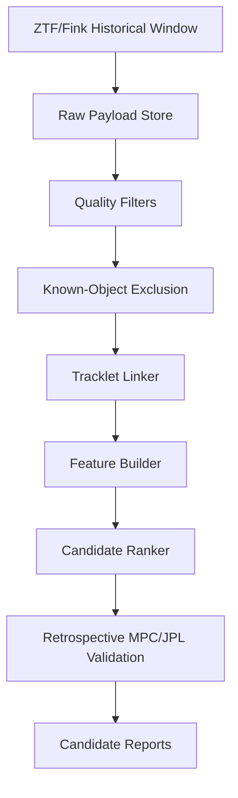

# Coding Agent Brief: AI Pipeline for Finding New Near-Earth Object Candidates

## Purpose

Build an AI-assisted discovery pipeline for identifying **new Near-Earth Object (NEO) candidates** from public astronomical survey data.

This project is **not** a classifier for already-cataloged NEOs. The target is to find candidate moving objects that are not already associated with known Minor Planet Center (MPC) or JPL Small-Body Database objects at the time of observation, then rank them for follow-up or historical validation.

## Required Scientific Framing

Use precise language throughout the code, docs, reports, and UI:

- Say **candidate NEO**, **candidate moving object**, **unassociated moving-source candidate**, or **potential NEO candidate**.
- Do **not** claim discovery, detection, confirmation, or expert validation unless the object has been confirmed by the appropriate authority.
- MPC confirmation is the relevant authority path for minor planet observations.
- JPL Scout and similar services evaluate unconfirmed NEOCP objects, but they do not make a candidate automatically confirmed.

The pipeline should support discovery-oriented workflows:

1. Detect transient or moving sources in survey images or alert packets.
2. Filter out detections associated with known objects using time-aware MPC/JPL state.
3. Link detections into tracklets and candidate trajectories.
4. Estimate candidate motion and preliminary orbit/risk features.
5. Rank candidates for follow-up or archival validation.
6. Validate retrospectively against later MPC/JPL outcomes.

## Key Correction From Prior Static-Catalog Approach

Do not train only on a table of existing NEOs and non-NEOs. That would produce a useful orbital classifier, but it would not discover new NEOs.

For new-object discovery, the main training and evaluation unit is:

> survey alerts / detections / image cutouts over time, plus historical knowledge of whether each source was known at that observation time.

Known objects are still useful, but mainly for:

- Calibration.
- Time-aware masking of known-object associations in historical replay.
- Positive examples of real moving objects.
- Negative examples and artifact rejection.
- Retrospective validation after an object later appears in MPC/JPL records.

## Project Decisions

The user has approved the following implementation direction:

- **Phase 1 source path:** ZTF DR24 / public ZTF archive data plus Fink-FAT and SNAPS as discovery-oriented references.
- **First model target:** a candidate ranker, not a final "NEO detector."
- **First evaluation mode:** historical replay, not live monitoring.
- **Optimal architecture:** a hybrid, auditable pipeline with rule-based filtering/linking plus a LightGBM/XGBoost candidate ranker. Do not start with an end-to-end deep model.

The first useful model should rank:

> unassociated moving-source candidates that are likely to be real and NEO-like.

It must not claim a confirmed discovery. It should produce auditable candidates for retrospective validation and later human/follow-up review.

## Dataset Size Summary

| Dataset / source | Published size | Use in this project |
|---|---:|---|
| ZTF Public Data Release 24 | 69.7 million single-exposure images; 188 thousand co-added images; 1,043 billion source detections; 5.32 billion light curves | Primary large public image/catalog archive for historical replay. |
| Fink-FAT / ZTF alert analysis | 111,275,131 processed ZTF alerts; 389,530 Solar System alert candidates; 327 extracted new orbits | Primary discovery-method precedent and candidate-linking benchmark. |
| SNAPS SNAPShot1 | 5,458,459 observations of 31,693 asteroids | Secondary Solar System object dataset for features, outlier scoring, and validation ideas. |
| Rubin alert stream | 800,000 first-night public alerts; expected up to about 7 million alerts per night | Later integration target after ZTF replay is stable. |
| JPL SBDB Query API | Current count must be fetched with `info=count`; documentation includes example count output | Known-object exclusion and retrospective outcome enrichment, not primary discovery training. |
| MPC Observations API | No single total dataset size stated in cited API docs | Published observation retrieval by designation for retrospective validation and orbit/refit tests. |
| Fink public API / SSO endpoints | No single total dataset size stated on API landing page | Practical broker access for ZTF objects, cutouts, SSO data, and Solar System candidates. |

## Pretrained Model Strategy

Use pretrained models as feature extractors, baselines, or initialization points. Do **not** use a pretrained model by itself to claim a new NEO discovery.

The project-approved first model remains a historical-replay **candidate ranker**. Pretrained models may feed features into that ranker, but confirmation remains outside the model.

| Priority | Model/path | Role | How to find/use | Verification required |
|---:|---|---|---|---|
| 1 | DeepStreaks | ZTF-specific fast-moving streak detection design baseline. | Start from the paper: [DeepStreaks: identifying fast-moving objects in the Zwicky Transient Facility data with deep learning](https://arxiv.org/abs/1904.05920). Search for public code/weights before implementation. | Do not assume public reusable weights exist. If weights are unavailable, reimplement only a minimal architecture/baseline and train/evaluate on historical replay data. |
| 2 | Generic vision backbones: DINOv2, ConvNeXt, EfficientNet, ResNet | Image/cutout embedding for science/reference/difference image triplets or streak cutouts. | Prefer `timm` and/or Hugging Face model hubs. Candidate package names: `timm`, `torchvision`, `transformers`. Use frozen embeddings first; fine-tune only after baseline replay works. | Record exact model name, weights source, license, parameter count, cache size, preprocessing, and input image normalization. |
| 3 | AstroM3-CLIP | Astronomy-specific embeddings for photometry, spectra, and metadata where compatible. | Hugging Face: [AstroMLCore/AstroM3-CLIP](https://huggingface.co/AstroMLCore/AstroM3-CLIP). The model card points to the AstroM3 GitHub workflow and preprocessing requirements. | Verify preprocessing compatibility. Do not use if the ZTF/Fink fields cannot be transformed into the expected photometry/metadata format without fragile assumptions. |
| 4 | Chronos / Chronos-Bolt style time-series models | Optional time-series embeddings or anomaly scores for alert histories/light curves. | Start from Amazon Chronos model collection and paper: [Chronos: Learning the Language of Time Series](https://arxiv.org/abs/2403.07815). Use only after a simple handcrafted-feature baseline exists. | Chronos is general time-series, not astronomy-specific NEO detection. Document any synthetic data used in the model's original pretraining and keep it separate from project training labels. |
| 5 | Fink-FAT / SNAPS methods | Pipeline and feature-engineering references, not necessarily pretrained weights. | Use [Fink-FAT](https://arxiv.org/abs/2305.01123) for alert linking/candidate generation design and [SNAPS SNAPShot1](https://arxiv.org/abs/2302.01239) for Solar System feature/outlier ideas. | Treat papers as method references unless public code/data artifacts are verified in Phase 0. |
| 6 | XGBoost / LightGBM / logistic regression | Actual first candidate ranker. | Train from historical replay features: tracklet quality, motion, quality flags, artifact scores, known-object exclusion results, and retrospective outcomes. | This is the first model to evaluate as the project model. It must be trained/evaluated with no future-catalog leakage. |

### Pretrained Model Usage Rules

- Use pretrained models to produce embeddings or auxiliary scores.
- Keep the first ranker simple and auditable: LightGBM/XGBoost/logistic regression before deep end-to-end training.
- Cache pretrained weights separately from survey data.
- Record exact model identifiers, versions, licenses, parameter counts, download sizes, and local cache paths.
- Do not download large model families blindly. Start with one small/base model per family.
- Do not exceed local storage budgets without asking the user.
- Do not use synthetic project data as the primary training basis. If a third-party pretrained model used synthetic data during its original pretraining, document that fact and keep it separate from this project's training labels.
- If a pretrained model requires preprocessing that cannot be reproduced exactly, do not use it for benchmark claims.

### Required Pretrained Model Audit File

Before using any pretrained model in training or evaluation, create `pretrained_model_audit.md` with:

- Model name and exact identifier.
- Source URL.
- Weights license.
- Download size and local cache path.
- Required Python package and version.
- Input schema and preprocessing.
- Whether the model is frozen, fine-tuned, or used only for embeddings.
- Whether the original model documentation mentions synthetic pretraining data.
- Known limitations for NEO candidate ranking.
- Decision: `use`, `defer`, or `reject`.

### Starter Implementation Notes

Use these as Phase 0 probes only. Do not build the whole pipeline around any one model until historical replay proves it helps.

Generic vision embeddings with `timm`:

```python
import timm
import torch

model = timm.create_model("convnext_tiny", pretrained=True, num_classes=0)
model.eval()

with torch.no_grad():
    embedding = model(batch_images)  # batch_images must use the model's expected normalization.
```

Generic vision embeddings with Hugging Face / DINOv2:

```python
from transformers import AutoImageProcessor, AutoModel

processor = AutoImageProcessor.from_pretrained("facebook/dinov2-small")
model = AutoModel.from_pretrained("facebook/dinov2-small")
```

AstroM3-CLIP:

```python
# First verify the upstream repository and preprocessing requirements.
# The model card points to AstroMLCore/AstroM3-CLIP and the AstroM3 GitHub workflow.
```

Chronos-style time-series models:

```python
# Treat as optional after handcrafted light-curve features exist.
# Verify model package, model ID, license, and whether the model uses synthetic pretraining data.
```

Candidate ranker:

```python
# Preferred first project model:
# train LightGBM/XGBoost/logistic regression on historical replay features.
# Inputs should include tracklet features, artifact scores, image embeddings if available,
# known-object exclusion flags, and retrospective outcome labels.
```

## Best Public Data Sources

## Operational Access, Download, and Authentication Matrix

This section is intended to answer the practical coding-agent question: "Can I download this data now, and do I need credentials?"

| Source | Primary use | Starting endpoint or documentation | Auth/API key status | Notes for implementation |
|---|---|---|---|---|
| ZTF public image archive via IRSA | Historical images, science images, raw images, metadata, cutouts derived from image products | `https://irsa.ipac.caltech.edu/ibe/search/ztf/products/sci?` and `https://irsa.ipac.caltech.edu/ibe/search/ztf/products/raw?`; docs: [IRSA ZTF API](https://irsa.ipac.caltech.edu/docs/program_interface/ztf_api.html) | Public ZTF data: no API key is indicated/expected. Proprietary ZTF data: IRSA username/password required. | Start with public data only. Do not attempt proprietary access unless the user explicitly provides credentials. |
| ZTF alert stream / archive | Alert packets from difference imaging, including moving object candidates | [ZTF Alert Stream](https://www.ztf.caltech.edu/ztf-alert-stream.html) | Access mechanism depends on archive/broker route. Verify current access path before implementation. | Use Fink or another broker if direct alert archive access is cumbersome. |
| Fink/ZTF API | Brokered ZTF objects, cutouts, Solar System objects, Solar System candidates, schema discovery | `https://api.fink-portal.org/`; public paths include `/api/v1/schema`, `/api/v1/objects`, `/api/v1/cutouts`, `/api/v1/sso`, `/api/v1/ssocand`, `/api/v1/ssoft` | No API key is indicated by the public Swagger landing page. Verify method/auth from `https://api.fink-portal.org/swagger.json` at runtime. | First broker API to investigate for `ssocand`, `ssoft`, and cutout retrieval. |
| JPL SBDB Query API | Current known-object metadata and labels for exclusion/evaluation | `https://ssd-api.jpl.nasa.gov/sbdb_query.api` | No API key is indicated/expected for public API. Verify at runtime. | Use for current snapshots, but avoid future-catalog leakage in historical replay. |
| JPL SBDB object API | Per-object metadata, orbit data, close-approach context | `https://ssd-api.jpl.nasa.gov/sbdb.api` | No API key is indicated/expected for public API. Verify at runtime. | Use for enrichment after candidate matching, not as primary discovery data. |
| MPC Observations API | Published observations for known objects | `https://data.minorplanetcenter.net/api/get-obs` | No API key indicated for published observations. Unpublished astrometry is suppressed. | Query by designation. Useful for retrospective validation and orbit/refit tests. |
| MPC pointing submissions | Exposure pointing metadata and future community coordination | [MPC Pointing Submissions](https://docs.minorplanetcenter.net/services/submissions/) | Submission access/identity may require appropriate MPC station/observer setup. | Do not submit automatically. This is for later follow-up workflow design. |
| Rubin alerts via brokers | Forward-looking public alert stream | [Rubin Alerts and Brokers](https://rubinobservatory.org/for-scientists/data-products/alerts-and-brokers) | Rubin alert packets are world-public with no proprietary period. Broker-specific APIs may require accounts or tokens. | Use only after ZTF historical replay is stable. |
| Rubin Science Platform | Prompt Products Database, images, catalogs, moving objects | [Rubin Data Access](https://rubinobservatory.org/for-scientists/data-products/data-access) | RSP accounts are for Rubin data-rights holders. | Do not assume the user has RSP access. Broker alerts are the public-access path. |

### API Key Summary

Known from the cited public documentation:

- **ZTF public IRSA image/archive data:** no API key is indicated/expected for public data.
- **ZTF proprietary data:** requires IRSA username/password. Do not use unless explicitly provided.
- **Fink public API:** no API key is indicated by the public API landing page; verify against `swagger.json`.
- **JPL SBDB APIs:** no API key is indicated/expected; verify at runtime.
- **MPC published observation APIs:** no API key indicated for published observations.
- **Rubin alerts:** world-public through brokers; individual brokers may require account/API-token setup.
- **Rubin Science Platform:** requires Rubin data-rights account; do not treat it as open public access.

If any service returns `401`, `403`, an HTML login page, or rate-limit response, the agent must stop and document the access requirement instead of silently scraping or inventing credentials.

## Assumption Audit

This brief was checked for unverified operational assumptions. The agent must treat the following as Phase 0 verification items before building training jobs.

| Item | Status in this brief | Required agent action |
|---|---|---|
| ZTF DR24 dataset size | Stated from ZTF public release page. | Record source URL and release identifier in `data_sources_verified.md`. |
| Fink-FAT counts | Stated from published Fink-FAT paper. | Record paper URL and do not treat counts as current live API totals. |
| SNAPS SNAPShot1 size | Stated from published SNAPS paper. | Verify current public access path before ingestion. |
| Fink API auth and schema | Public landing page advertises endpoints; auth not indicated there. | Fetch `swagger.json`, test selected endpoints, and record auth/rate-limit behavior. |
| ZTF alert archive access | Public ZTF docs describe alerts, but exact replay access path may depend on broker/archive. | Verify direct archive or broker access before coding assumptions. |
| IRSA ZTF public image access | Public docs describe API and note proprietary access requires password. | Test a public metadata query and one planned product download. |
| JPL SBDB current count | Must be fetched live with `info=count`; no static current count is asserted here. | Fetch and store current count with API signature/version. |
| MPC observations total size | No single total size asserted. | Query only by designation for validation; do not assume bulk access. |
| Rubin alerts | Public and no proprietary period per Rubin docs; broker mechanics may vary. | Defer until Phase 4 and verify broker-specific API/account requirements. |
| DeepStreaks reusable weights | Not assumed. DeepStreaks is included as a design baseline because of direct ZTF fast-moving object relevance. | Search for public code/weights; if unavailable, document as `design_reference_only`. |
| Generic vision backbones | Assumed available through common ML libraries, but exact models and cache sizes are not fixed here. | Verify one small/base model first and record model ID, license, download size, and preprocessing. |
| AstroM3-CLIP compatibility | Not assumed. It may not map cleanly to ZTF/Fink candidate fields. | Verify preprocessing and required modalities before using embeddings. |
| Chronos/Chronos-Bolt compatibility | Not assumed. Chronos is general time-series, not NEO-specific. | Use only as optional embedding/anomaly feature after simple baselines. |

If any Phase 0 check conflicts with this brief, the code must follow the live verified source behavior and update the docs.

## Concrete Starting API Calls

These are starter calls for Phase 0 verification. They are not the full production ingestion system.

### JPL SBDB Query: Current Known-Object Catalog Metadata

Purpose:

- Build a current known-object table.
- Verify field names.
- Establish a known-object exclusion/enrichment source.

Example:

```text
https://ssd-api.jpl.nasa.gov/sbdb_query.api?fields=spkid,pdes,full_name,kind,class,neo,pha,moid,H,epoch,e,a,q,i,om,w,ma,n_obs_used,data_arc,first_obs,last_obs&full-prec=true
```

Recommended behavior:

- Store the API response signature/version.
- Store fetch timestamp.
- Store the exact request URL.
- Page results if the API requires pagination or returns too much data.
- Prefer `spkid` and `pdes` as stable identifiers. Do not depend on internal `id` fields.

### JPL SBDB Query: NEO-Only Current Catalog

Purpose:

- Evaluation/enrichment only.
- Do not use this as the main training dataset for discovery.

**Correction (2026-07-02, live-verified)**: the `neo=Y` parameter below is
**incorrect** and is rejected by the live API with HTTP 400
(`"one or more query parameter was not recognized"`). The verified working
filter parameter is `sb-group=neo`, confirmed via a live operator `curl` call
that returned real NEO records (e.g. 433 Eros, `class: AMO`). Evidence:
`docs/evidence/phase0/2026-07-02-first-live-probe-console.md`. Per this
brief's own §Assumption Audit rule ("If any Phase 0 check conflicts with
this brief, the code must follow the live verified source behavior and
update the docs"), use `sb-group=neo`, not `neo=Y`.

Example (original brief text, kept for reference — do not use `neo=Y` as written):

```text
https://ssd-api.jpl.nasa.gov/sbdb_query.api?fields=spkid,pdes,full_name,class,neo,pha,moid,H,epoch,e,a,q,i,om,w,ma&neo=Y&full-prec=true
```

Corrected, live-verified example:

```text
https://ssd-api.jpl.nasa.gov/sbdb_query.api?fields=spkid,pdes,full_name,class,neo,pha,moid,H,epoch,e,a,q,i,om,w,ma&sb-group=neo&full-prec=true
```

### MPC Observations API: Published Observations for One Designation

Purpose:

- Retrieve published observations after a candidate is associated with a known/provisional designation.
- Support orbit refit tests and retrospective validation.

Endpoint:

```text
https://data.minorplanetcenter.net/api/get-obs
```

Example shape:

```text
https://data.minorplanetcenter.net/api/get-obs?desigs=433&output_format=XML
```

Implementation note:

- `desigs` is required and supports one designation per documented request.
- `output_format` can include `XML`, `ADES_DF`, `OBS_DF`, or `OBS80`.
- Unpublished observations may be suppressed.

### IRSA ZTF Image Metadata Search

Purpose:

- Find public ZTF image products for a sky position/time/filter.
- Construct downloadable data-product URLs according to IRSA metadata.

Science image metadata endpoint prefix:

```text
https://irsa.ipac.caltech.edu/ibe/search/ztf/products/sci?
```

Raw image metadata endpoint prefix:

```text
https://irsa.ipac.caltech.edu/ibe/search/ztf/products/raw?
```

Example shape from IRSA documentation:

```text
https://irsa.ipac.caltech.edu/ibe/search/ztf/products/sci?POS=358.3,25.6
```

Implementation note:

- Use public data only by default.
- If the response indicates proprietary access is required, stop and report that credentials are needed.
- Use IRSA metadata fields to construct actual product download URLs; do not guess file paths.

### Fink API Discovery

Purpose:

- Discover actual schema and available ZTF/Fink fields.
- Retrieve Solar System candidates and cutouts if public API permits.

Base:

```text
https://api.fink-portal.org/
```

Schema endpoint:

```text
https://api.fink-portal.org/api/v1/schema
```

Swagger/OpenAPI metadata:

```text
https://api.fink-portal.org/swagger.json
```

Relevant advertised endpoints:

```text
/api/v1/objects
/api/v1/cutouts
/api/v1/sso
/api/v1/ssocand
/api/v1/ssoft
/api/v1/schema
```

Implementation note:

- The coding agent must inspect `swagger.json` before hard-coding HTTP methods or payloads.
- Prefer `ssocand` and `ssoft` for Solar System candidate work if they are available without authentication.
- Persist the returned schema with a timestamp.

## Minimum Local Data Schemas

Use these schemas as normalized internal tables. Adjust field names to the repo's style, but preserve the concepts and provenance fields.

### `survey_alerts`

| Field | Type | Required | Description |
|---|---:|---:|---|
| `alert_id` | string | yes | Unique alert identifier from source broker/archive. |
| `source_survey` | string | yes | `ztf`, `rubin`, etc. |
| `source_broker` | string | no | `fink`, `antares`, `lasair`, etc. |
| `object_id` | string | no | Broker object ID if present. |
| `candidate_id` | string | no | Local candidate ID after pipeline grouping. |
| `observation_time_utc` | datetime | yes | Alert observation time in UTC. |
| `mjd` | float | no | Observation time as MJD if provided or derived. |
| `ra_deg` | float | yes | Right ascension in degrees. |
| `dec_deg` | float | yes | Declination in degrees. |
| `mag` | float | no | Magnitude if available. |
| `mag_err` | float | no | Magnitude uncertainty if available. |
| `flux` | float | no | Flux if available. |
| `flux_err` | float | no | Flux uncertainty if available. |
| `filter` | string | no | Survey filter/band. |
| `rb_score` | float | no | Real/bogus or equivalent alert quality score. |
| `raw_payload_uri` | string | yes | Local path or immutable URI to the raw alert payload. |
| `ingested_at_utc` | datetime | yes | Pipeline ingestion timestamp. |

### `image_products`

| Field | Type | Required | Description |
|---|---:|---:|---|
| `image_product_id` | string | yes | Local stable ID for an image/cutout/product. |
| `source_survey` | string | yes | `ztf`, `rubin`, etc. |
| `product_type` | string | yes | `science`, `reference`, `difference`, `raw`, `cutout`. |
| `observation_time_utc` | datetime | no | Image observation time. |
| `ra_center_deg` | float | no | Image/cutout center RA. |
| `dec_center_deg` | float | no | Image/cutout center Dec. |
| `filter` | string | no | Filter/band. |
| `download_url` | string | no | Original download URL if public. |
| `local_path` | string | no | Local file path after download. |
| `sha256` | string | no | Content hash for reproducibility. |
| `proprietary_required` | boolean | yes | Whether download required non-public auth. |
| `retrieved_at_utc` | datetime | yes | Retrieval timestamp. |

### `known_object_catalog_snapshots`

| Field | Type | Required | Description |
|---|---:|---:|---|
| `snapshot_id` | string | yes | Stable ID for this catalog snapshot. |
| `source` | string | yes | `jpl_sbdb`, `mpc`, etc. |
| `source_url` | string | yes | Exact URL or API query. |
| `fetched_at_utc` | datetime | yes | Fetch timestamp. |
| `valid_for_replay_before_utc` | datetime | no | Latest replay time this snapshot may be used for without leakage. |
| `signature_version` | string | no | API signature/version if provided. |
| `raw_payload_uri` | string | yes | Local path or durable URI to raw response. |
| `record_count` | integer | no | Count of objects in snapshot. |

### `known_objects`

| Field | Type | Required | Description |
|---|---:|---:|---|
| `snapshot_id` | string | yes | Foreign key to `known_object_catalog_snapshots`. |
| `spkid` | string | no | JPL SPK-ID. |
| `pdes` | string | no | Primary designation. |
| `full_name` | string | no | Full designation/name. |
| `kind` | string | no | JPL object kind code. |
| `orbit_class` | string | no | Orbit classification code. |
| `neo` | boolean | no | NEO flag from catalog. |
| `pha` | boolean | no | PHA flag from catalog. |
| `moid_au` | float | no | Earth MOID in AU. |
| `H` | float | no | Absolute magnitude. |
| `epoch` | float | no | Orbit epoch. |
| `a_au` | float | no | Semimajor axis. |
| `e` | float | no | Eccentricity. |
| `q_au` | float | no | Perihelion distance. |
| `i_deg` | float | no | Inclination. |
| `om_deg` | float | no | Longitude of ascending node. |
| `w_deg` | float | no | Argument of perihelion. |
| `ma_deg` | float | no | Mean anomaly. |
| `first_obs` | date | no | First observation date from catalog. |
| `last_obs` | date | no | Last observation date from catalog. |
| `n_obs_used` | integer | no | Number of observations used in orbit. |
| `data_arc_days` | float | no | Observation arc length. |

### `known_object_associations`

| Field | Type | Required | Description |
|---|---:|---:|---|
| `association_id` | string | yes | Stable association ID. |
| `alert_id` | string | yes | Alert being tested. |
| `snapshot_id` | string | yes | Catalog snapshot used. |
| `matched` | boolean | yes | Whether a known object was matched. |
| `matched_spkid` | string | no | Matched JPL SPK-ID if available. |
| `matched_pdes` | string | no | Matched primary designation if available. |
| `angular_sep_arcsec` | float | no | Separation from predicted position. |
| `mag_residual` | float | no | Observed minus predicted magnitude if available. |
| `match_method` | string | yes | Method/tool used for association. |
| `catalog_state_time_utc` | datetime | yes | Catalog state used for replay. |
| `created_at_utc` | datetime | yes | Association timestamp. |

### `tracklets`

| Field | Type | Required | Description |
|---|---:|---:|---|
| `tracklet_id` | string | yes | Local tracklet ID. |
| `candidate_id` | string | yes | Local candidate ID. |
| `alert_ids` | array/string | yes | Ordered alert IDs included in tracklet. |
| `start_time_utc` | datetime | yes | First detection time. |
| `end_time_utc` | datetime | yes | Last detection time. |
| `detection_count` | integer | yes | Number of detections. |
| `rate_arcsec_per_min` | float | no | Plane-of-sky angular rate. |
| `pa_deg` | float | no | Position angle of motion. |
| `fit_rms_arcsec` | float | no | Linear/trajectory fit residual. |
| `is_known_sso_at_observation_time` | boolean | yes | True if associated with known object during replay. |
| `created_at_utc` | datetime | yes | Tracklet creation timestamp. |

### `candidate_rankings`

| Field | Type | Required | Description |
|---|---:|---:|---|
| `candidate_id` | string | yes | Local candidate ID. |
| `tracklet_id` | string | yes | Tracklet being ranked. |
| `model_name` | string | yes | Ranking model or heuristic name. |
| `model_version` | string | yes | Ranking model version. |
| `real_source_score` | float | no | Probability source is real. |
| `moving_object_score` | float | no | Probability source is a real moving object. |
| `neo_likelihood_score` | float | no | NEO-likelihood score. |
| `followup_priority_score` | float | no | Follow-up priority score. |
| `rank_reason` | string | no | Human-readable explanation. |
| `created_at_utc` | datetime | yes | Ranking timestamp. |

### `retrospective_outcomes`

| Field | Type | Required | Description |
|---|---:|---:|---|
| `candidate_id` | string | yes | Local candidate ID. |
| `evaluation_cutoff_utc` | datetime | yes | Future date used to check outcomes. |
| `later_mpc_designation` | string | no | Later designation if assigned. |
| `later_jpl_spkid` | string | no | Later JPL SPK-ID if assigned. |
| `was_later_confirmed_minor_planet` | boolean | yes | Retrospective confirmation label. |
| `was_later_confirmed_neo` | boolean | yes | Retrospective NEO label. |
| `was_later_associated_with_known_object` | boolean | yes | Later association to an already-known object. |
| `outcome_source_url` | string | no | Exact source used for outcome. |
| `evaluated_at_utc` | datetime | yes | Evaluation timestamp. |

## Required Phase 0 Deliverables

Before model training, the coding agent must produce:

1. `data_sources_verified.md`
   - Exact endpoints tested.
   - HTTP methods tested.
   - Whether auth was required.
   - Rate-limit or access errors.
   - Example response snippets with secrets redacted.

2. `schema_snapshot/`
   - Raw Fink schema response if Fink is used.
   - Raw JPL SBDB query metadata/signature.
   - Any IRSA metadata column descriptions encountered.

3. `sample_ingest_report.md`
   - Number of alerts/images/catalog rows downloaded.
   - Date/time range.
   - Public/proprietary status.
   - Local file paths.
   - Hashes for downloaded files.

4. `auth_requirements.md`
   - Services that worked without credentials.
   - Services that required credentials.
   - Services intentionally skipped because they were proprietary or submission-related.

5. `pretrained_model_audit.md`
   - Exact pretrained model candidates tested.
   - Whether public weights were found.
   - Download size and local cache path.
   - License and citation notes.
   - Whether each candidate is approved for use, deferred, or rejected.

### 1. Zwicky Transient Facility (ZTF) Alert Stream and Archive

Primary public source for current implementation.

ZTF streams sources detected above threshold in difference images, including transients, variables, and moving objects. This is directly aligned with candidate discovery because it starts from alert/image-difference events rather than a static catalog.

Relevant official source:

- [ZTF Alert Stream](https://www.ztf.caltech.edu/ztf-alert-stream.html)

Useful associated archive/API:

- [IRSA ZTF API](https://irsa.ipac.caltech.edu/docs/program_interface/ztf_api.html)

Recommended uses:

- Alert-packet ingestion.
- Difference-image candidate filtering.
- Image cutout model training.
- Historical blind replay.
- Moving-object candidate linking.

### 2. Fink Broker and Fink-FAT

Fink-FAT is the strongest public precedent for this exact task.

The published Fink-FAT work used ZTF alert data to identify new Solar System object candidates from massive alert streams. It reduced 111,275,131 processed ZTF alerts from November 2019 through December 2022 to 389,530 new Solar System alert candidates, then extracted 327 new orbits. At the time of the paper, 65 of those were still unreported in the MPC database.

Relevant source:

- [Enabling discovery of solar system objects in large alert data streams](https://arxiv.org/abs/2305.01123)

Recommended uses:

- Architecture reference.
- Baseline candidate-linking approach.
- Evaluation benchmark style.
- Feature engineering reference for motion/linking.

Do not blindly copy the implementation. Use the paper as a design anchor and reproduce a minimal, testable version suited to this repo.

### 3. Rubin Observatory Alerts and Solar System Products

Rubin is the most important forward-looking alert source.

Rubin states that alerts began streaming in real time to brokers on February 24, 2026 during the Early Science era. Rubin also states that Solar System data are available through the MPC, with a Rubin-only subset maintained by the Asteroid Institute.

Relevant sources:

- [Rubin Recent Data Releases](https://rubinobservatory.org/for-scientists/data-products/recent-data-releases)
- [Rubin Scientists FAQ](https://lsst.org/scientists/faq)
- [Rubin DP1 Solar System Processing](https://dp1.lsst.io/processing/moving/ss_drp.html)

Recommended uses:

- Later-stage integration target.
- Broker-based alert ingestion.
- Future validation against Rubin Solar System products.

Implementation note:

Start with ZTF unless the repo already has Rubin broker integration. ZTF is more mature for public historical replay and reproducible development.

### 4. Minor Planet Center (MPC)

MPC is the authoritative archive and confirmation path for minor planet observations.

Relevant sources:

- [MPC Public Documentation Hub: Pointing Submissions](https://docs.minorplanetcenter.net/services/submissions/)
- [NASA Near-Earth Object Observations Program](https://www.nasa.gov/solar-system/near-earth-object-observations-program/)

Recommended uses:

- Known-object exclusion.
- Observation/report formatting research.
- Historical validation.
- Follow-up workflow design.

Important:

MPC data should be used in a **time-aware** way. If evaluating a historical date, do not use a future catalog state to decide whether an object was already known.

### 5. MPC NEO Confirmation Page and JPL Scout

NEOCP and Scout are validation/follow-up layers, not the main training set.

JPL Scout analyzes recently detected objects on the MPC Near-Earth Object Confirmation Page. Scout explicitly warns that NEOCP objects are unconfirmed, may be real asteroids, may be known objects, or may be artifacts. Objects disappear from NEOCP/Scout after confirmation, association with known objects, or failure to confirm.

Relevant source:

- [JPL Scout: NEOCP Hazard Assessment](https://cneos.jpl.nasa.gov/scout/intro.html)

Recommended uses:

- Candidate status monitoring.
- Follow-up prioritization context.
- Retrospective outcome labels where available.

## Dataset Strategy

### Do Not Use a Static NEO Table as the Main Dataset

A static table from JPL SBDB is useful for orbital metadata and labels, but not sufficient for finding new NEOs.

Static catalog classification answers:

> Given an already-known object with an orbit, is it an NEO or PHA?

Discovery answers:

> Given noisy alerts/images across time, is there an unassociated moving object worth follow-up?

The second question is the project goal.

### Recommended Phase 1 Dataset

Use ZTF DR24/public ZTF archive data plus Fink/Fink-FAT and SNAPS as reference paths.

The Phase 1 implementation should prioritize historical replay over live monitoring:

- Select a bounded historical ZTF time window.
- Ingest public ZTF alert/object/cutout data through Fink if reproducible access is available.
- Use IRSA ZTF image metadata/products where image-level validation or cutouts are needed.
- Use SNAPS SNAPShot1 as a secondary feature/validation reference, not as the only training source.
- Use JPL SBDB/MPC only for known-object exclusion and retrospective validation.

Build records like:

```text
alert_id
object_id or candidate_id
observation_time
ra
dec
mag / flux features
filter
image cutout paths if available
difference-image features
known_object_match_at_time: true/false
known_object_designation_at_time
later_mpc_designation if any
later_neo_status if any
artifact_or_rejected if known
```

### Recommended Labels

Use multiple labels, because discovery is not a single binary classification problem.

Suggested labels:

- `is_real_moving_source`
- `is_artifact`
- `is_known_sso_at_observation_time`
- `is_unassociated_candidate_at_observation_time`
- `was_later_associated_with_known_object`
- `was_later_confirmed_minor_planet`
- `was_later_confirmed_neo`
- `neo_likelihood_score`
- `followup_priority_score`

The first model target is a **candidate ranker**, not a final detector or confirmer.

The key training target should initially be:

> rank unassociated moving-source candidates that are likely to be real and NEO-like.

## Historical Replay: Approved First Evaluation Mode

This is the most important evaluation method.

For a historical interval:

1. Choose a time window, for example one month of ZTF alerts.
2. Reconstruct or approximate the known-object catalog state at the beginning of that time window.
3. Run the discovery pipeline using only data available up to each alert time.
4. Suppress detections associated with objects known at that time.
5. Link remaining detections into tracklets.
6. Rank candidates.
7. Compare ranked candidates with later MPC/JPL outcomes.

Evaluation metrics:

- Recall of objects later confirmed as minor planets.
- Recall of objects later confirmed as NEOs.
- False positive rate from artifacts and non-moving transients.
- Candidate purity at top K.
- Time-to-candidate after first observation.
- Tracklet quality.
- Ephemeris uncertainty growth.
- Follow-up usefulness.

Avoid data leakage:

- Do not use future object designations during candidate generation.
- Do not use future orbital elements for model features.
- Do not use final MPC/JPL class labels except in evaluation.

## Pipeline Architecture

Use the architecture below as the implementation spine. The coding agent should build these components in order and should not replace this with an end-to-end deep-learning system unless historical replay results justify that later.

| Layer | Component | Purpose | First implementation |
|---:|---|---|---|
| 1 | Source verifier | Confirm Fink, IRSA ZTF, JPL SBDB, MPC, and pretrained-model access before ingesting data. | Small HTTP/API probes plus `data_sources_verified.md`, `auth_requirements.md`, and `pretrained_model_audit.md`. |
| 2 | Historical replay ingestor | Pull a bounded historical ZTF/Fink window with raw payloads, hashes, timestamps, and provenance. | One small public ZTF/Fink window; do not exceed storage limits. |
| 3 | Known-object exclusion | Suppress detections associated with objects already known at observation time. | Time-aware JPL/MPC catalog snapshot lookup. |
| 4 | Alert/image quality filter | Remove obvious artifacts, poor detections, bad cutouts, bad photometry, and low-confidence alerts. | Rule-based quality checks plus simple real/bogus score handling if available. |
| 5 | Feature builder | Build auditable tabular features for ranking. | Motion rate, direction consistency, brightness, filter, SNR, sky position, quality flags, detection count, and time span. |
| 6 | Optional embedding layer | Add frozen image/cutout embeddings if cutouts are available and storage allows. | `convnext_tiny` via `timm` first; DINOv2 second. |
| 7 | Tracklet linker | Link unassociated detections into candidate moving-object tracklets. | Linear motion plus time/direction consistency. |
| 8 | Candidate ranker | Rank candidate tracklets by "real, moving, NEO-like, follow-up-worthy." | LightGBM or XGBoost; logistic regression as baseline comparison. |
| 9 | Retrospective validator | Compare candidates against later MPC/JPL outcomes without future-catalog leakage. | Time-window evaluation with top-K purity and recall. |
| 10 | Candidate report generator | Produce auditable candidate reports without claiming discovery. | Markdown/JSON reports with provenance, features, scores, and caveats. |

Recommended data flow:



Recommended modules:

```text
data_ingest/
  ztf_alerts.py
  ztf_cutouts.py
  rubin_alerts.py
  mpc_catalog_snapshots.py

association/
  known_object_matcher.py
  time_aware_catalog.py

detection/
  alert_quality_filter.py
  artifact_rejection.py
  cutout_model.py

pretrained/
  model_registry.py
  embedding_extractors.py
  pretrained_model_audit.md

linking/
  tracklet_builder.py
  trajectory_linker.py
  motion_features.py

orbit/
  preliminary_orbit.py
  ephemeris_uncertainty.py

ranking/
  neo_candidate_ranker.py
  followup_priority.py

evaluation/
  historical_replay.py
  mpc_outcome_match.py
  metrics.py

reports/
  candidate_report.py
  validation_report.py
```

## Model Approach

Use a staged model rather than one monolithic model.

The first production candidate model should be:

```text
LightGBM/XGBoost candidate ranker
```

The first comparison baseline should be:

```text
Logistic regression over the same tabular features
```

Deep learning is optional supporting evidence, not the core of the first system.

Do not name the first model `neo_detector` or describe it as detecting confirmed NEOs. Prefer names such as:

- `candidate_ranker`
- `moving_source_ranker`
- `neo_like_candidate_ranker`
- `followup_priority_ranker`

### Stage 1: Alert Quality and Artifact Rejection

Input:

- Alert features.
- Difference-image metadata.
- Optional science/reference/difference cutouts.

Output:

- Probability that the alert is real.
- Probability that the alert is an artifact.

Model candidates:

- Gradient boosted trees for tabular alert features.
- Small CNN or vision transformer for cutout triplets.
- Ensemble of tabular and image models.
- Optional frozen image embeddings from DINOv2/ConvNeXt/EfficientNet/ResNet.

### Stage 2: Moving-Source Candidate Detection

Input:

- Alert positions and times.
- Candidate motion between detections.
- Known-object exclusion results.

Output:

- Probability that detections represent a real moving Solar System object.

Model candidates:

- Rule-based baseline using angular rate, direction consistency, magnitude consistency.
- Graph/linking model for candidate associations.
- Learning-to-rank model over possible tracklets.
- DeepStreaks-style streak classifier if the historical window includes fast-moving streak candidates.

### Stage 3: Tracklet and Orbit Candidate Ranking

Input:

- Linked detections.
- Plane-of-sky motion.
- Preliminary orbit fit quality if available.
- Solar elongation, galactic latitude, limiting magnitude, sky-plane rate.
- Uncertainty growth.

Output:

- NEO-likelihood score.
- Follow-up priority score.

Model candidates:

- LightGBM or XGBoost as the first project model.
- Logistic regression baseline for interpretability.
- Random forest only if gradient boosting is unavailable.
- Learning-to-rank model once enough historical replay labels exist.
- Optional AstroM3/Chronos-style embeddings if they pass the pretrained model audit.

## Baselines to Implement First

Before deep learning, implement clear baselines:

1. Alert quality filter.
2. Known-object association filter.
3. Linear motion tracklet linker.
4. Minimum tracklet length requirement.
5. Simple NEO-likelihood heuristic based on rate of motion, brightness, solar elongation, and preliminary orbit fit if available.

Only add deep learning once the baseline replay works.

## Architecture Decision Rules

The coding agent must follow these decision rules:

1. Build the rule-based historical replay baseline before training any deep model.
2. Build known-object exclusion before candidate ranking.
3. Build simple linear tracklet linking before graph/neural linking.
4. Train LightGBM/XGBoost before experimenting with end-to-end neural ranking.
5. Use image embeddings only as extra features; do not make image embeddings mandatory for Phase 1.
6. Use DeepStreaks only for streak-specific candidates or as a design reference until public weights/code are verified.
7. Defer AstroM3/Chronos unless tabular replay is working and the needed input schema can be reproduced exactly.
8. Treat every candidate score as a prioritization score, not a discovery or confirmation.

## Guardrails

The code must not:

- Claim a new NEO has been discovered.
- Submit anything to MPC automatically.
- Treat a single alert as a discovery.
- Treat an unconfirmed NEOCP object as a confirmed NEO.
- Train with future catalog state when running historical replay.
- Use synthetic detections as the primary training basis unless explicitly marked as simulation-only.

The code should:

- Log all source data provenance.
- Preserve observation timestamps.
- Preserve catalog snapshot timestamps.
- Distinguish known-object matches from later confirmations.
- Produce auditable candidate reports.
- Keep candidate ranking separate from confirmation.

## Candidate Report Contents

Each candidate report should include:

- Candidate ID.
- Detection count.
- Observation timestamps.
- RA/Dec sequence.
- Apparent magnitude or flux sequence.
- Angular rate and direction.
- Known-object association result at observation time.
- Catalog snapshot date used for association.
- Preliminary orbit fit result if available.
- NEO-likelihood score.
- Follow-up priority score.
- Image cutouts or links if available.
- Reasons for ranking.
- Caveat: candidate is unconfirmed until validated by appropriate authority.

## Near-Term Implementation Plan

### Phase 0: Source Verification

- Verify exact ZTF alert/archive access method available to the current environment.
- Verify whether Fink APIs or public data products can be accessed reproducibly.
- Identify MPC/JPL catalog snapshot strategy.
- Document all API limits and authentication requirements.
- Create `pretrained_model_audit.md`.
- Verify whether DeepStreaks public code/weights exist. If not, mark DeepStreaks as a design baseline only.
- Verify one generic vision backbone path using `timm`, `torchvision`, or `transformers`.
- Verify AstroM3-CLIP preprocessing requirements before attempting to use it.

### Phase 1: ZTF DR24 + Fink/SNAPS Historical Replay Prototype

- Choose a bounded historical ZTF time window.
- Verify whether Fink public APIs can provide the needed ZTF alert/object/cutout or Solar System candidate records for that interval.
- If Fink access is insufficient, fall back to IRSA ZTF public archive metadata/products for image-level work and document the limitation.
- Use Fink-FAT as the candidate-linking architecture reference.
- Use SNAPS SNAPShot1 as a secondary reference for Solar System object features and outlier-scoring ideas.
- Ingest a small historical ZTF/Fink sample.
- Store alerts in a normalized local schema.
- Implement known-object association using time-aware catalog data.
- Implement rule-based alert/image quality filters.
- Build handcrafted tabular features.
- Build simple linear tracklets from unassociated alerts.
- Train logistic regression as the comparison baseline.
- Train LightGBM or XGBoost as the first candidate ranker.
- If image cutouts are available, test one frozen generic vision embedding path and compare it against handcrafted/tabular features.
- Generate candidate reports.

### Phase 2: Validation

- Compare historical candidates against later MPC/JPL outcomes.
- Compute recall and candidate purity at top K.
- Compare logistic regression versus LightGBM/XGBoost.
- Run an ablation: tabular-only versus tabular plus optional image embeddings.
- Add improved artifact rejection only after the first replay metrics are available.

### Phase 3: Scale Historical Replay

- Scale ingestion to larger ZTF windows.
- Improve tracklet linking and ranking.
- Add repeatable benchmark splits by time window.
- Add candidate report review tooling.

### Phase 4: Live/Broker Monitoring

- Add live Fink or other broker monitoring only after historical replay is working.
- Add Rubin broker integration only after ZTF replay is stable.
- Keep live candidate monitoring separate from confirmation or submission workflows.

## Success Criteria

Minimum useful milestone:

- Given a historical ZTF time window, the pipeline produces ranked unassociated moving-source candidates with no future-catalog leakage.

Strong milestone:

- The pipeline recovers a meaningful fraction of objects later confirmed as minor planets or NEOs in historical replay while keeping top-K candidate volume low enough for human review.

Production-grade milestone:

- The pipeline can run continuously on an alert stream, produce auditable candidate reports, and separate candidate ranking from MPC-style confirmation workflows.

## Bottom Line

The best public path for finding new NEO candidates is:

> ZTF DR24/public ZTF archive data + Fink-FAT/SNAPS guidance + time-aware MPC/JPL exclusion + historical replay validation.

Rubin alerts are the major next integration target, but ZTF is the safer first implementation target because it has mature public historical data and published discovery-oriented precedent.
